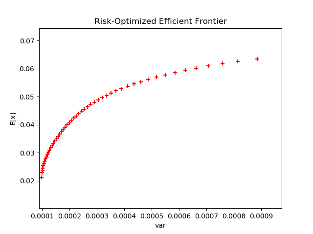
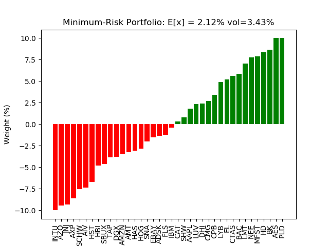
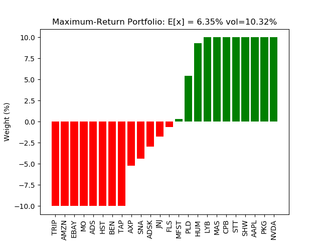

# Sequential Quadratic Programming (Active Set)
## Constrained least squares and portfolio optimization examples
Python implementation of a primal active set method for sequential quadratic programming.

A base ActiveSet class implements the generic form of the algorithm while derived classes implement the small set of required problem-specific calculations. Two examples of application classes derived from the ActiveSet base class are described below: **ConstrainedLS** is a constrained least squares solver class while **PortfolioOpt** is a minimum-risk MVO portfolio optimizer class.

## ActiveSet base class (activeset.py)
### Parameters
A : array_like 2d \
&nbsp;&nbsp;&nbsp;&nbsp;objective function coefficient matrix \
b : array_like 1d or single-column 2d (optional) \
&nbsp;&nbsp;&nbsp;&nbsp;objective function target vector \
Ce : array_like 2d (optional) \
&nbsp;&nbsp;&nbsp;&nbsp;equality constraint coefficient matrix \
de : array_like 1d or single-column 2d (optional) \
&nbsp;&nbsp;&nbsp;&nbsp;equality constraint target vector \
Ci : array_like 2d (optional) \
&nbsp;&nbsp;&nbsp;&nbsp;inequality constraint coefficient matrix \
di : array_like 1d or single-column 2d (optional) \
&nbsp;&nbsp;&nbsp;&nbsp;inequality constraint target vector \
cu : array_like 1d or single-column 2d (optional) \
&nbsp;&nbsp;&nbsp;&nbsp;upper-bound constraint vector \
cl : array_like 1d or single-column 2d (optional) \
&nbsp;&nbsp;&nbsp;&nbsp;lower-bound constraint vector \
x0 : array_like 1d or single-column 2d (optional) \
&nbsp;&nbsp;&nbsp;&nbsp;initial feasible solution

### Returns
x : ndarray \
&nbsp;&nbsp;&nbsp;&nbsp;final solution \
scr : float \
&nbsp;&nbsp;&nbsp;&nbsp;objective function value of final solution \
nit : int \
&nbsp;&nbsp;&nbsp;&nbsp;number of active set iterations

### Notes
The ActiveSet class implements the primal form of active set method
to solve the generic quadratic program:

    min f(x)
    s.t. Ax = b
         Cx <= d
         lb <= x <= ub

where f(x) is a generic quadratic objective function to be minimized subject to a set of linear equality and inequality constraints. The KKT matrix form of the QP is:

    |  H  C.T  |   |  x  |   |  h  |
    |          | * |     | = |     |
    |  C   0   |   |  l  |   |  d  |

    where:
     H = objective function Hessian matrix
     h = objective function Hessian target vector
     C = constraint coefficient matrix
     d = constraint target vector
     x = solution vector
     l = Lagrangian vector

An active-set method must start from a feasible initial solution. For many problems deriving a feasible initial solution is a trivial problem and can be user-provided. Otherwise, an equality-constrained linear program is solved. Subsequently, at each iteration of the active set algorithm, an equality-constrained KKT subproblem is solved to find the next step direction (with an associated calculation to find the magnitude of the step). The KKT form of the subproblem is very similar to the above except where:

      C = AC = active constraint matrix
      x = p = directional step vector
      h = h - H * x_cur
      d = 0

Two methods are provided for solving the directional-step KKT subproblem: direct KKT system solution and the more numerically stable null space method (Gill & Murray, 1978). Since numerical stability comes at the cost of increased computation, the code is currently set up to run the null space method only in the case of direct calculation error due to a poorly conditioned KKT matrix, etc.

It should be noted that no structure-based code optimizations were attempted (e.g., sparsity optimizations, optimized factorization updates, etc). Given the extreme code optimizations employed in the underlying BLAS/LAPACK linear algebra libraries, potential performance improvements gained through additional optimization procedures would typically only be observed in the very largest of  problems. One such code-optimization example is QR/Cholesky factorization updates for the null space method (Nocedal & Wright, 2006). Null space factorization updates based on Givens rotations can be used to avoid full refactorizations during the active set iterations.

The ActiveSet class can be thought-of as an abstract base class without actually using the abc library. This was done to help facilitate inter-operability between python 2.x and 3.x versions.
The ActiveSet class requires derived classes to define functions for objective and Hessian function calculation. Two examples of derived classes can be found below: ConstrainedLS is a
constrained least squares solver; PortfolioOpt is an MVO portfolio optimizer.

### References
Gill, P. E. & Murray, W. Numerically Stable Methods for Quadratic Programming. *Mathematical Programming*, 14, 1978.

Nocedal, J. & Wright, S.J. (2006). *Numerical Optimization*. Springer-Verlag. New York, NY.

Wong, E. (2011). *Active-Set Methods for Quadratic Programming* (Doctoral Dissertation). University of California, San Diego, CA.

### Requirements
Python 3.6 \
Numpy 1.13.1 \
Statsmodels 0.9.0 \
Pandas 0.20.3

### Running
Please see the source files for examples.

### Additional Info
Please see comments in the source files for additional info.

## ConstrainedLS derived class (constrainedls.py)
The ConstrainedLS derived class implements an active set constrained least squares solver. The objective function to be minimized for the ConstrainedLS class is simply the sum of the squared residuals or, alternatively, the square of the residual Frobenius norm:

    min || A * x - b || ** 2

    where:
      A = objective function coefficient matrix
      b = objective function target vector
      || . || = Frobenius norm
      x = solution vector

The primary application motivating this class implementation is weight optimization for scoring ensembles in machine learning applications, but many use cases can be envisioned. One of the most common uses for constrained least squares is regression with non-negative coefficients. The supplied code file contains the input validation and unit tests for the ActiveSet base class. An example is shown below:

    Example:
        A = [[0.9501, 0.7620, 0.6153, 0.4057],
             [0.2311, 0.4564, 0.7919, 0.9354],
             [0.6068, 0.0185, 0.9218, 0.9169],
             [0.4859, 0.8214, 0.7382, 0.4102],
             [0.8912, 0.4447, 0.1762, 0.8936]]
        b = [0.0578, 0.3528, 0.8131, 0.0098, 0.1388]
        Ci = [[0.2027, 0.2721, 0.7467, 0.4659],
              [0.1987, 0.1988, 0.4450, 0.4186],
              [0.6037, 0.0152, 0.9318, 0.8462]]
        di = [0.5251, 0.2026, 0.6721]
        Ce = [[3, 5, 7, 9]]
        de = [4]
        cu = [2, 2, 2, 2]
        cl = [-0.1, -0.1, -0.1, -0.1]

        cls = ConstrainedLS(atol=1e-7)
        x, scr, nit = cls(A, b, Ce, de, Ci, di, cu, cl)

        print(x, scr, nit)
        [[-0.10000], [-0.10000], [0.15991], [0.40896]]
        0.16951
        3

## PortfolioOpt derived class (portfolio.py)
The PortfolioOpt derived class implements an active set risk-optimized portfolio MVO solver. The objective function to be minimized for the PortfolioOpt class is a quadratic function of the covariance matrix which represents the conditional variance (risk) of the given portfolio:

    min w * Q * w

    where:
      Q = covariance matrix
      w = portfolio weights vector

It should be noted that there are a number of different objective functions that can be used for portfolio optimization, e.g. utility, Sharpe/Sortino ratio, etc. The goal here is not to present a treatise on portfolio optimization techniques, but rather how an active set solver fits into such a framework. As such, a simple risk-optimized long/short portfolio optimization example is presented here:

Input: \
&nbsp;&nbsp;&nbsp;&nbsp;60 monthly returns (10/2014-10/2019) for 50 S&P 500 stocks \
Calculated Input: \
&nbsp;&nbsp;&nbsp;&nbsp;covariance matrix \
&nbsp;&nbsp;&nbsp;&nbsp;next-month forecasts \
Constraints: \
&nbsp;&nbsp;&nbsp;&nbsp;5% liquidity buffer \
&nbsp;&nbsp;&nbsp;&nbsp;no leverage \
&nbsp;&nbsp;&nbsp;&nbsp;dollar neutrality \
&nbsp;&nbsp;&nbsp;&nbsp;short book bounds: -10% <= x <= 0% \
&nbsp;&nbsp;&nbsp;&nbsp;long book bounds: 0 <= x <= 10% \
Output: \
&nbsp;&nbsp;&nbsp;&nbsp;efficient frontier \
&nbsp;&nbsp;&nbsp;&nbsp;minimum-risk portfolio weights \
&nbsp;&nbsp;&nbsp;&nbsp;maximum-return portfolio weights

<u>**Security Selection**</u>

As can be seen in the summary above, the goal of this example is to generate a risk-optimized L/S dollar-neutral portfolio from a selected set of 50 S&P500 stocks. In a typical QEPM flow, a subset of securities is selected from a universe of potential candidates (in this case US large-cap equities) through the application of a predictive pricing model (i.e., alpha model). Alpha models are typically econometric factor models but alternative ML/AI approaches utilizing non-traditional unstructured data sets (e.g., text-based NLP approaches for sentiment analysis, event-driven headline scanning, etc) have been gaining attention in the literature. For this example, a (somewhat) random subset of 50 S&P500 stocks has been selected for the optimization procedure.

<u>**Book Assignment**</u>

For typical L/S strategies, the selection procedure also assigns securities to either the long or short book usually through some form of forecast ranking. Since the 50 stocks in this example were not selected via alpha model, an ad hoc ranking mechanism is required for book assignment. For the purposes of this simple example, a 6-period moving average of returns is used as the alpha/ranking model (which can be thought of as a simple momentum-based model). The stocks with the top 25 forecast returns are assigned to the long book while the bottom 25 are assigned to the short book. Only gross returns are considered here whereas a production QEPM flow would incorporate transaction costs.

<u>**Covariance Estimation**</u>

As shown in the objective function above, the covariance matrix of security returns is required to calculate the conditional variance (risk) for a given portfolio. Since covariance is asymptotic, finite-sample estimation is required (i.e., risk model). Risk-model covariance estimation techniques are thoroughly covered in the literature. There are a number of vendor-supplied risk models (i.e., Barra, FactSet, etc) while many firms choose to use proprietary risk models employing some form of dimensionality reduction and/or shrinkage approach. For this simple example, the sample covariance matrix is used for objective function calculation.

<u>**Constraints**</u>

Constraints are typically implemented to enforce risk-based investment mandates. As with objective functions, there are countless proposals in the literature for different types of constraints (e.g. transaction cost / turnover constraints, etc). For this simple example three types of constraints are used: total weight, individual weight, and dollar neutrality. The total weight constraint is in the form of an unleveraged 5% liquidity buffer. In other words, the total weight of each book sums to 95% of liquidation value rather than the typical 100%. This results in a portfolio consisting of 5% free cash, 95% leveraged cash, 95% long book, and 95% short book.

Neutrality constraints are also quite effective for managing risk. Besides dollar neutrality which enforces equal AUM for the long and short books, other neutrality constraints can be applied to the portfolio such as sector neutrality, factor neutrality, etc. Strict neutrality is enforced through equality constraints while biased neutrality is enforced through inequality constraints. For this example, strict dollar neutrality is enforced through equality.

Bound constraints are typically used for enforcing diversification and are amongst the most effective types of constraints for reducing overall portfolio risk. They are typically mandated by risk management in consultation with the governing investment committee. For this example, bounds for the long book are specified as 0% <= x <= 10% and bounds for the short book are specified as -10% <= x <= 0%.

<u>**Output**</u>

Given the above, the output of the optimization procedure is an efficient frontier of risk-optimized portfolios. Each portfolio represents the minimum-risk implementation for a given expected return. For each step of the efficient frontier, a quadratic program consisting of the above objective function and associated constraints is solved via active set method as described above. **Figure 1** below shows the efficient frontier generated for the example optimization. The x-axis represents portfolio variance while the y-axis represents expected portfolio return.

**Figure 1 - Efficient frontier** \

The efficient frontier allows the portfolio manager to make systematic risk/return trade-offs when constructing the next-period portfolio. If the efficient frontier has been constructed correctly, a horizontally oriented parabola should be readily apparent with the vertex representing the minimum-risk (or maximum Sharpe, etc) portfolio over the range of expected portfolio returns. Typically, the lower half of the efficient frontier is not displayed as is the case in the figure above. For this example, the minimum-risk portfolio is shown below in **Figure 2** while the maximum-return portfolio is shown below in **Figure 3**. For each figure, monthly conditional variances are converted to the more common annualized volatility (vol).

**Figure 2 - Minimum-risk portfolio** \

As can be seen in the two portfolio composition figures, expected return and conditional variance are both larger in the maximum-return portfolio which is to be expected. There is a greater degree of diversification seen in the minimum-risk portfolio with only 3 maximum-weights and 12 zero-weights while the maximum return portfolio has 16 maximum weights and 26 zero weights.

**Figure 3 - Maximum-return portfolio** \

